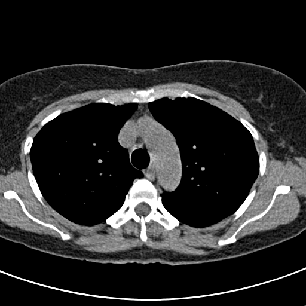
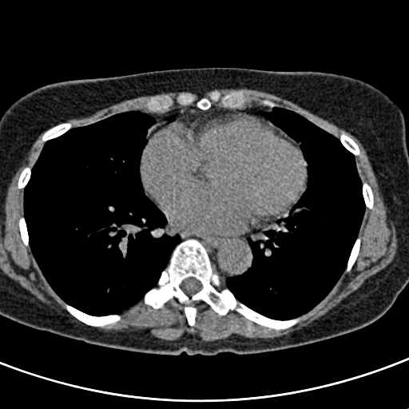
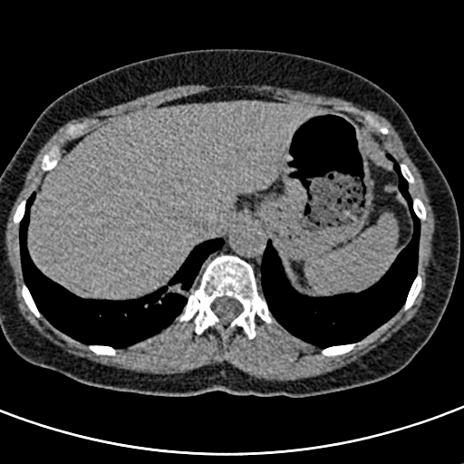

# DICOM Viewer

A Python pipeline I built for loading, processing, and rendering DICOM medical images. It takes raw CT scan data (single files or a whole folder of slices) and turns it into something you can actually look at, going through the same rescale/window steps a real radiology viewer would use under the hood.

I used the NLST lung-screening sample series (`sample_data/ct-lung-screening-nlst-series/`) as my main test data while building this.

## Why I built this the way I did

The thing that surprised me most going into this project is that a DICOM file isn't really an image at all. It's a raw integer array plus a bunch of scanner-specific metadata, and you have to do actual math on it before it looks like anything. Get the math wrong and you either get a blown-out white image, an inverted photo-negative-looking scan, or something that looks fine but is medically meaningless.

So most of this project is really about getting that conversion pipeline right, and then handling the edge cases that come up once you start using real downloaded data instead of a perfectly clean single file.

## The math behind it

CT scanners store radiodensity as raw sensor integers, not actual physical units. Every DICOM file has a `RescaleSlope` ($m$) and `RescaleIntercept` ($b$) tag that convert those raw values into Hounsfield Units (HU), which is the actual standardized density scale (air is about -1000, water is 0, bone goes up past +1000):

$$H(x, y) = m \cdot P_{raw}(x, y) + b$$

I implemented this in `processing_engine.apply_rescale`. One thing I ran into here: if you don't upcast the array to float32 before doing this multiplication, you get integer overflow wraparound because HU values go negative and the raw data comes in as unsigned ints. That bug produced some genuinely bizarre-looking images before I figured out what was happening.

Once you have HU values, the next problem is that a scan can have a range of 4000+ HU, but your screen only has 256 grey levels. So you pick a window, a center ($c$) and width ($w$), and squash just that range down to 0-255:

$$L = c - \frac{w}{2}, \quad U = c + \frac{w}{2}$$

$$N(x, y) = \begin{cases} 0 & H(x, y) \le L \\ \dfrac{H(x, y) - L}{w} & L < H(x, y) < U \\ 1 & H(x, y) \ge U \end{cases}$$

$$D(x, y) = \lfloor N(x, y) \cdot 255 \rfloor$$

This is what lets you look at "lung window" vs "bone window" on the same scan and see completely different detail.

There's also a photometric quirk: most files use `MONOCHROME2` (dense = bright), but some use `MONOCHROME1` where it's flipped. If you don't check for this, those files render inverted:

$$D_{inverted}(x, y) = 255 - D(x, y)$$

For picking a region and getting basic stats out of it (mean/std over a rectangle), it's just the standard formulas:

$$\mu_{ROI} = \frac{1}{T}\sum R(i,j), \qquad \sigma_{ROI} = \sqrt{\frac{1}{T}\sum (R(i,j) - \mu_{ROI})^2}$$

The last piece of math is in `mpr.py`. CT scans usually don't have equal spacing in all directions, like 0.7mm between pixels in a slice but 2.5mm between slices, so if you try to cut a coronal or sagittal view straight out of the raw volume it comes out looking squished. `resample_to_isotropic` fixes that by resampling the whole volume to equal spacing on all three axes first (using `scipy.ndimage.zoom`), and it figures out the real slice spacing from the actual z-positions of the slices instead of trusting the `SliceThickness` tag, which isn't always accurate if slices overlap.

## Project layout

```
dicom-viewer/
├── src/dicom_viewer/       package code, installable
│   ├── dicom_parser.py       load one file + pull metadata safely
│   ├── dicom_series.py       stack a folder of slices into one 3D volume
│   ├── series_grouping.py    split a folder into separate scans if it's mixed
│   ├── processing_engine.py  the rescale/window/ROI math above, all numpy
│   ├── mpr.py                 coronal/sagittal views via isotropic resampling
│   └── image_export.py       array -> base64 PNG/JPEG
├── tests/                   pytest suite, uses synthetic dicom data
├── scripts/run_local_series.py   manual CLI I use to eyeball real scans
├── sample_data/              the actual 150-slice CT series I tested on
├── docs/output_previews/     rendered PNGs from past runs
├── pyproject.toml
├── requirements.txt
└── README.md
```

I moved things into a `src/` layout partway through because I kept running into path issues when trying to import the modules from `tests/` and `scripts/` separately. Once it's an actual installable package (`pip install -e .`) everything just imports normally instead of needing sys.path hacks.

## Walking through what each file actually does

**`dicom_parser.py`** loads a single `.dcm` file and pulls out the stuff I need (rows/cols, rescale slope/intercept, window center/width, pixel spacing, etc.) into a `DicomMetadata` dataclass. A lot of real files are missing tags you'd expect to always be there, so basically every field has a fallback default. It also checks the file actually has `PixelData` before going further, since some DICOM files are just reports or presentation states with no image in them, which threw a confusing error the first time I hit one.

**`series_grouping.py`** exists because not every folder you download is actually one clean scan. I ran into public datasets where a scout/localizer series got bundled in with the real scan, and `dicom_series.load_dicom_series` would just fail with a shape mismatch and no real explanation. This module reads only the `SeriesInstanceUID` tag (skips pixel data entirely so it's fast) and splits the folder into per-series groups so you know what you're actually dealing with before loading anything.

**`dicom_series.py`** takes a folder of slices and stacks them into one 3D volume, sorted by the z-coordinate from `ImagePositionPatient` rather than filename (filenames aren't reliable for ordering). `load_dicom_series_safe` builds on the grouping module to handle folders with more than one series automatically.

**`processing_engine.py`** is all the numpy math from above. Fully vectorized, no per-pixel loops, since that would be way too slow on 512x512 arrays.

**`mpr.py`** does the coronal/sagittal reconstruction described above.

**`image_export.py`** takes the final 8-bit array and turns it into a base64 PNG or JPEG so it can go straight into an image tag or API response without touching disk.

**`scripts/run_local_series.py`** is my manual testing script, not part of the automated suite. It has single file / whole series / batch modes, and for batch mode it just logs failures instead of stopping on the first bad file, which was actually really useful for finding out how often real data breaks my assumptions.

## Testing

The `tests/` folder is a real pytest suite, separate from the manual script. The fixtures in `conftest.py` build small synthetic DICOM datasets in memory instead of using the sample scan, on purpose, so I can hit specific edge cases (missing tags, MONOCHROME1, a window width of zero, two series mixed in one folder) without needing the real data to happen to contain them.

```bash
pip install -e ".[dev]"
pytest --cov=dicom_viewer --cov-report=term-missing
```

## Problems I ran into

- **Overflow on rescale** — mentioned above, fixed by upcasting to float32 before the multiply instead of after.
- **Tags that aren't scalars** — `WindowCenter`/`WindowWidth` can legally be stored as multi-value arrays instead of a single number. I added a small helper (`_first_value`) that just grabs the first value so the rest of the code doesn't have to think about it.
- **Missing window values entirely** — some files just don't have a window center/width at all. When that happens I fall back to computing one from the actual data range:

$$w_{auto} = \max(H) - \min(H), \qquad c_{auto} = \frac{\max(H) + \min(H)}{2}$$

- **Mixed series in one folder** — covered above, this is what `series_grouping.py` is for.
- **Non-isotropic voxels** — covered above, this is what the resampling in `mpr.py` is for.

## Setup

```bash
pip install -e ".[dev]"
```

That pulls in `pydicom`, `numpy`, `pillow`, `scipy`, plus pytest for testing.

One more thing: some real DICOM files use compression (JPEG2000, JPEG Lossless, RLE) that `pydicom` can't decode on its own. If you hit that, `dicom_parser` will actually tell you which package you're missing, but to just install everything up front:

```bash
pip install pylibjpeg pylibjpeg-libjpeg pylibjpeg-openjpeg python-gdcm
```

To try it on the sample data:

```bash
python scripts/run_local_series.py --series sample_data/ct-lung-screening-nlst-series
```

## Results



Upper chest slice. You can see the trachea (dark, low density air) clearly separated from the bone around it, which is what told me the windowing math was actually working right and not just "looks okay by accident."



Mid-cardiac level, soft tissue windowing. The heart outline and the aorta (the circle above the spine) show up clearly without losing the lung detail around them.



A slice right next to the one above, same series. Mostly here to show the rendering stays consistent slice to slice and doesn't randomly shift contrast.

## Known limitations

- ROI is just a rectangle right now (row/col bounds), no freehand selection.
- The MPR resampling uses linear interpolation, which looks fine but isn't what you'd want for anything actually diagnostic.
- Only handles single-channel CT-style data. Doesn't do anything with RGB `PhotometricInterpretation`.

## References

1. NEMA. (2024). *Digital Imaging and Communications in Medicine (DICOM) Standard*. https://www.dicomstandard.org/
2. Bushberg, J. T., Seibert, J. A., Leidholdt, E. M., & Boone, J. M. (2011). *The Essential Physics of Medical Imaging* (3rd ed.). Lippincott Williams & Wilkins.
3. Seeram, E. (2015). *Computed Tomography: Physical Principles, Clinical Applications, and Quality Control* (4th ed.). Saunders.
4. Mason, D., et al. (2023). *pydicom* (v2.4.4) [Software]. https://github.com/pydicom/pydicom
5. Harris, C. R., Millman, K. J., van der Walt, S. J., et al. (2020). Array programming with NumPy. *Nature*, 585, 357–362.
6. Clark, K., Vendt, B., Smith, K., et al. (2013). The Cancer Imaging Archive (TCIA). *Journal of Digital Imaging*, 26(6), 1045–1057.
